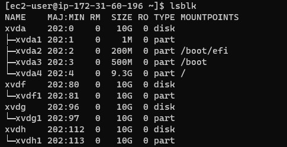
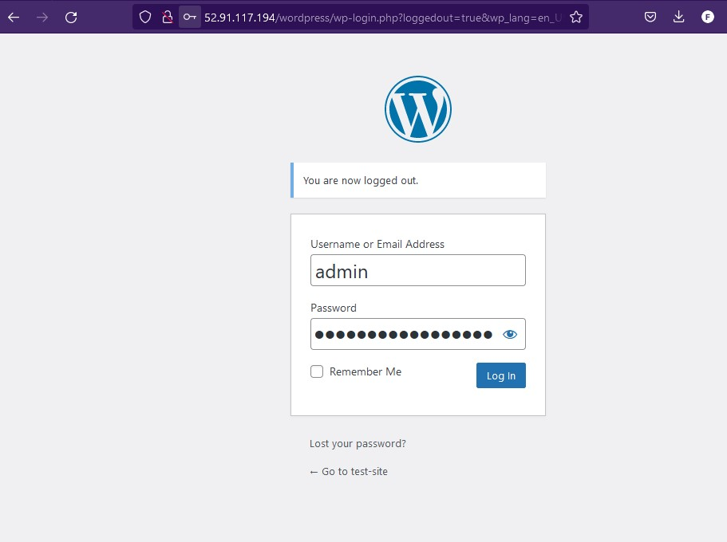

# Project 6 -  Web Solution With WordPress

## Step 1 - Launch an instance with the red hat AMI


## Edit the security group to allow ssh connections


## Step 2 - Create and attach three volumes to the new instance.


## Step 3 - Log into the instance and begin configuration

 > Update the repository

      sudo yum update

 > Upgrade the repository

      sudo yum upgrade

> Run the `lsblk` command used to inspect what block devices are attached to the server, In this case, you should see /dev/xvdf, /dev/xvdh, xvdg

    lsblk


> Step 4 - Run the `df -h` command used to see free space and mounted partition on the server.
 
    df -h


## Step 5 - Create new partition 

> Create a single partition on each of the 3 attached volume

    using the fdisk utility run the command

    sudo fdisk /dev/xvdf  - 1st disk
    sudo fdisk /dev/xvdg  - 2nd disk
    sudo fdisk /dev/xvdh  - 3rd disk


## Step 6 - View newly configured partiions on the attached drives.

> Running the `lsblk` command command to view the block devices attached to the server after been partitions using the fdisk utility



## Step 7 - Install lvm2 package

    sudo yum install lvm2


  
> Run `lvdiskscan` command to check for available partitions

    sudo lvmdiskscan
  


## Step 8 - pvcreate

> Use the `pvcreate` utility to make each of the 3 attached devices as physical volums to be used by LVM

    sudo pvcreate /dev/xvdf1
    sudo pvcreate /dev/xvdg1
    sudo pvcreate /dev/xvdh1


> Verity the physical volume has been created successfully by running 

    sudo pvs


## Step 9 - vgcreate

> Use the `vgcreate` utility to all 3 PVs to a volume group, name the VG 'webdata-vg

    sudo vgcreate webdata-vg /dev/xvdf1 /dev/xvdg1 /dev/xvdh1


> Verify the VG has been created successfully by running the `sudo vgs` command.

    sudo vgs


## Step 10 - lvcreate

> Create 2 logical volumes using the `lvcreate` utility, name them apps-lv and logs-lv

    Note: For apps-lv (use half of the PV size)
              logs-lv (use the remaining space of the PV size)

      apps-lv: will be used to store data for the website
      logs-lv: used to store data for logs.

  
    `sudo lvcreate -n apps-lv -L 14G webdata-vg`
    `sudo lvcreate -n logs-lv -L 14G webdata-vg`


> Verify logical volume was created successfully

    sudo lvs


## Step 11 - Verify the entire set up

> command 1
 
    sudo vgdisplay -v #view complete setup - VG, PV, and LV

> volume group 


> logical volume


> physical volume


> command 2

    sudo lsblk


## Step 12 - Format logical volumes

> Using the mkfs.ext4 command 

    sudo mkfs -t ext4 /dev/webdata-vg/apps-lv
    sudo mkfs -t ext4 /dev/webdata-vg/logs-lv


## Step 13 - Create /var/www/html directory to store website files

    sudo mkdir -p /var/www/html


## Step 14 - Create /home/recovery/logs to store backup of log data

    sudo mkdir -p /home/recovery/logs


## Step 15 - Mount /var/www/html on apps-lv logical volume

    sudo mount /dev/webdata-vg/apps-lv /var/www/html

## Step 16 - Use the rsync utility to backup all the files in the log directory /var/log into /home/recovery/logs

    sudo rsync -av /var/log/. /home/recovery/logs/

## Step 17 - Mount /var/log on logs-lv logical volume
   
    Note: all the existing data on /var/log will be deleted. That is why step 16 above is very important.

    sudo mount /dev/webdata-vg/logs-lv /var/log

## Step 18 - Restore log files back into /var/log directory

    sudo rsync -av /home/recovery/logs/. /var/log

## Step 19 - Update the `/etc/fstab` file so that the mount configuration will persist 

> The UUID of the device will be used to update the /etc/fstab file

> run the command `sudo blkid` to get the uuid of the logical volumes

    sudo blkid


> Edit the /etc/fstab file

    suod vi /etc/fstab


> Test the configuration and reload the daemon

    sudo mount -a
    sudo systemctl daemon-reload

> Run the command `df -h` to verify the setup


## Prepare the Database Server

> Lunch a second RedHat EC2 instance for the database server.

> Update repository

    sudo yum -y update 

> Upgrade repository

    sudo yum -y upgrade

> Run the `lsblk` command used to inspect what block devices are attached to the server, In this case, you should see /dev/xvdf, /dev/xvdh, xvdg

    lsblk


> Run the `df -h` command used to see free space and mounted partition on the server.
 
    df -h


> Create a single partition on each of the 3 attached volume

    using the fdisk utility run the command

    sudo fdisk /dev/xvdf  - 1st disk
    sudo fdisk /dev/xvdg  - 2nd disk
    sudo fdisk /dev/xvdh  - 3rd disk


> View newly configured partiions on the attached drives.

> Running the `lsblk` command command to view the block devices attached to the server after been partitions using the fdisk utility

    lsblk 


> Install yum install lvm2

    sudo yum install lvm2


> Run `lvmdiskscan` command to check for available partitions

    sudo lvmdiskscan
  


## pvcreate

> Use the `pvcreate` utility to make each of the 3 attached devices as physical volums to be used by LVM

    sudo pvcreate /dev/xvdf1
    sudo pvcreate /dev/xvdg1
    sudo pvcreate /dev/xvdh1


> Verity the physical volume has been created successfully by running 

    sudo pvs


## vgcreate

> Use the `vgcreate` utility to all 3 PVs to a volume group, name the VG 'webdata-vg

    sudo vgcreate dbdata-vg /dev/xvdf1 /dev/xvdg1 /dev/xvdh1


> Verify the VG has been created successfully by running the `sudo vgs` command.

    sudo vgs


## lvcreate

> Create 2 logical volumes using the `lvcreate` utility, name them apps-lv and logs-lv

    Note: For db-lv (use half of the PV size)
              logs-lv (use the remaining space of the PV size)

      apps-lv: will be used to store data for the website
      logs-lv: used to store data for logs.

  
    `sudo lvcreate -n apps-lv -L 14G dbdata-vg`
    `sudo lvcreate -n logs-lv -L 14G dbdata-vg`


> Verify logical volume was created successfully

    sudo lvs


## Verify the entire set up

> command 1
 
    sudo vgdisplay -v #view complete setup - VG, PV, and LV

> volume group 


> logical volume


> physical volume


> command 2

    sudo lsblk


> Install wget, Apache and it's dependencies
    sudo yum -y install wget httpd php php-mysqlnd php-fpm php-json

## Format logical volumes

> Using the mkfs.ext4 command 

    sudo mkfs -t ext4 /dev/dbdata-vg/apps-lv
    sudo mkfs -t ext4 /dev/dbdata-vg/logs-lv


## Create /db directory to store website files

    sudo mkdir -p /db


## Create /home/recovery/logs to store backup of log data

    sudo mkdir -p /home/recovery/logs


## Mount /var/www/html on apps-lv logical volume

    sudo mount /dev/dbdata-vg/db-lv /db


## Use the rsync utility to backup all the files in the log directory /var/log into /home/recovery/logs

    sudo rsync -av /var/log/. /home/recovery/logs/


## Mount /var/log on logs-lv logical volume
   
    Note: all the existing data on /var/log will be deleted. That is why step 16 above is very important.

    sudo mount /dev/dbdata-vg/logs-lv /var/log

## Restore log files back into /var/log directory

    sudo rsync -av /home/recovery/logs/. /var/log

## Update the `/etc/fstab` file so that the mount configuration will persist 

> The UUID of the device will be used to update the /etc/fstab file

> run the command `sudo blkid` to get the uuid of the logical volumes

    sudo blkid


> Edit the /etc/fstab file

    sudo vi /etc/fstab


> Test the configuration and reload the daemon

    sudo mount -a
    sudo systemctl daemon-reload

> Run the command `df -h` to verify the setup


## Installing wordPress on your Web Server 

> Launch the webserver and log into it

> Update the repository

    sudo yum -y update


> Install wget, Apache and it's dependencies

    sudo yum -y install wget httpd php php-mysqlnd php-fpm php-json


> Start Apache

    sudo systemctl start httpd
    sudo systemctl enable httpd


> Installing php and it's dependencies

    sudo yum install https://dl.fedoraproject.org/pub/epel/epel-release-latest-9.noarch.rpm


    sudo yum install yum-utils http://rpms.remirepo.net/enterprise/remi-release-9.rpm

    Note: The commands above has to match the current version of your RedHat O.S
    In my case right, I'm running a version 9.1,  that's why I have the "...release-9.rpm"


    sudo yum module list php


    sudo yum module reset php


    sudo yum module enable php:remi-7.4


    sudo yum install php php-opcache php-gd php-curl php-mysqlnd


    sudo systemctl start php-fpm

    sudo systemctl enable php-fpm


    sudo setsebool -P httpd_execmem 1

> Restart the Apache server

    sudo systemctl restart httpd

> Download wordpress and copy to the var/www/html directory

> Create a folder named 'wordpress'

    mkdir wordpress

> Navigate into the 'folder'

    cd wordpress

> Download wordpress

    sudo wget http://wordpress.org/latest.tar.gz

   

> Extract the `latest.tar.gz` file

    sudo tar xzvf latest.tar.gz


> Delete the compressed wordpress file

    sudo rm -rf latest.tar.gz

> Copy the 'wordpress-config-sample.php' file into the 'wordpress' directory

    sudo cp wordpress-config-sample.php wordpress/wp-config.php

> Edit the 'wordpress-config.php' file to and include the database settings


> Copy the 'wordpress' directory into the html directory

    sudo cp -R wordpress /var/www/html/

> Configure SELinux Policies

    sudo chown -R apache:apache /var/www/html/wordpress

    sudo chcon -t httpd_sys_rw_content_t /var/www/html/wordpress -R

    sudo setsebool -P httpd_can_network_connect=1 


## Log back into the database server

> Update the repository           

    sudo yum update

> Install mysql-server

    sudo yum install mysql-server


> Restart mysqld service

    sudo systemctl restart mysqld

> Enable mysqld service

    sudo systemctl enable mysqld


> Verify status

    sudo systemctl status mysqld


## Configure database to work with wordpress

```SQL
 sudo mysql -u root
 CREATE DATABASE wordpress;
 CREATE USER 'Funmibi'@'172.31.60.196' IDENTIFIED BY 'us3rp@ss';
 GRANT ALL ON wordpress.* TO 'Funmibi'@'172.31.60.196';
 FLUSH PRIVILEGES;
 SHOW DATABASES;
 exit
```


## Configure WordPress to connect to remote database
Hint: Do not forget to open MySQL port 3306 on DB Server EC2. For extra security, you shall allow access to the DB server ONLY from your Web Server’s IP address, so in the Inbound Rule configuration specify source as /32


## Edit the `my.cnf` file 


## Log back into the web-server

> Install MySQL client and test that you can connect from your web server to you DB server using `mysql-client`

    sudo yum install mysql


> Login frm mysql server from the mysql client

    sudo mysql -u admin -p -h 172.31.51.148

> Verify that you can successfully execute the `SHOW DATABASES;` command and see a list of existing databases.

    SHOW DATABASES;


> Change permissions and configuration so Apache could use WordPress

    sudo chown -R apache:apache /var/www/html/wordpress

> Enable TCP port 80 inbound rules configuration for your web server EC2 (enable from everywhere 0.0.0.0/0 or from your workstations's IP)


    
> Access from a web browser the link to your WordPress

    http://52.91.117.194/wordpress/




   
    


